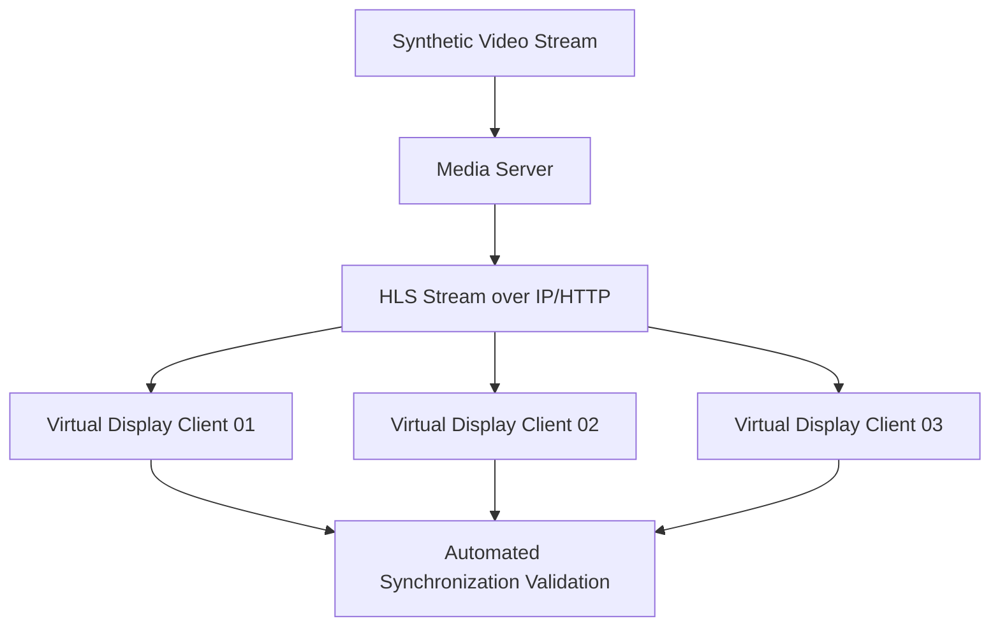
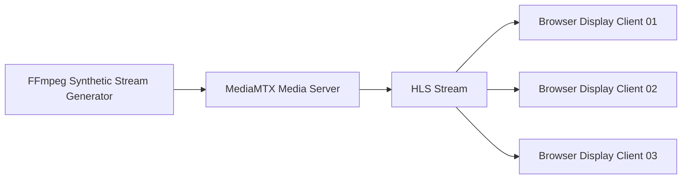
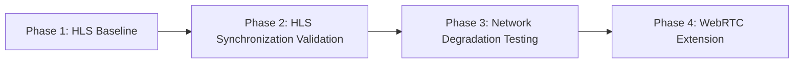
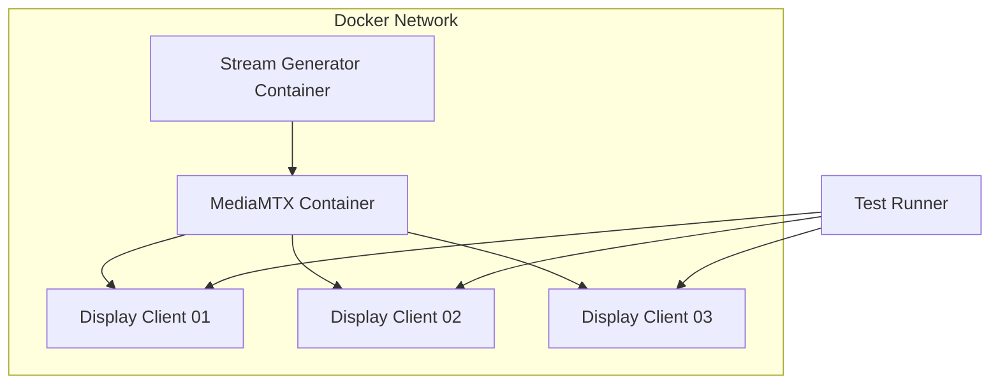
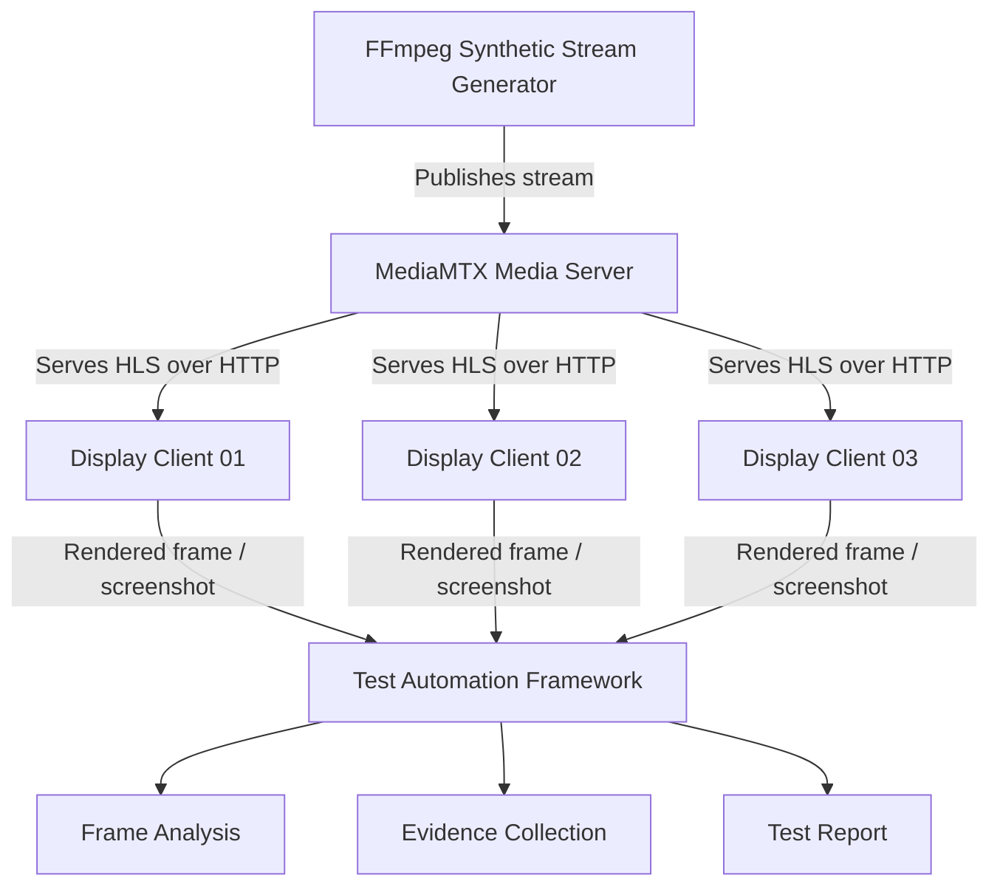
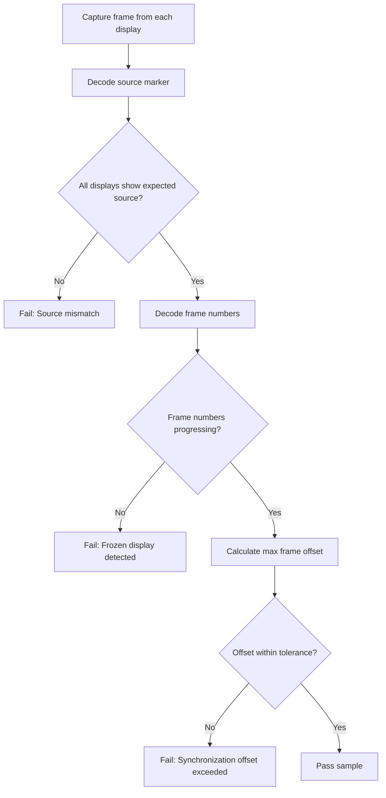
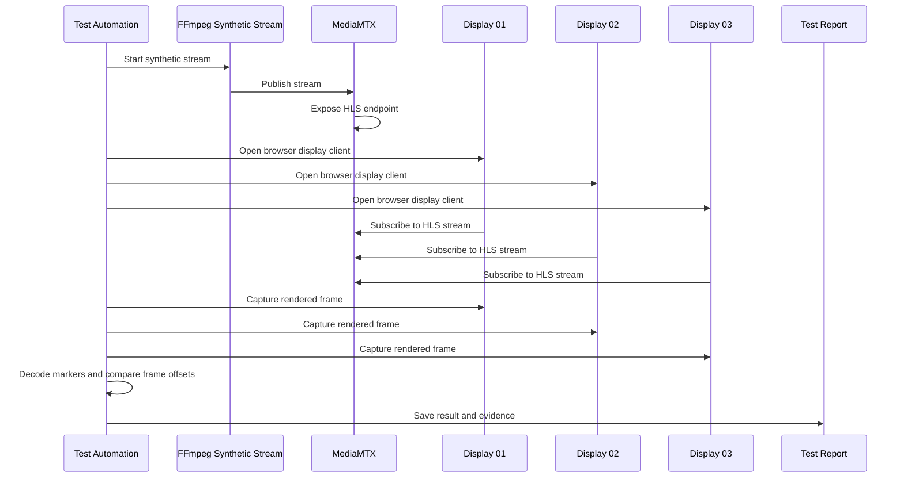

# Multi-Display Stream Synchronization Test Lab

## Project Overview

This project is a proof-of-concept test automation lab for validating **multi-display video stream synchronization** in an internet-style streaming environment.

The project simulates a common operational-awareness scenario: a single live video source is streamed over an IP network to multiple display clients, and automated tests verify that each display receives the correct stream, continues rendering frames, and remains synchronized within an acceptable tolerance.

The goal is to demonstrate a practical testing approach for systems where correctness is not limited to API responses or UI actions, but also depends on what is actually rendered across multiple network-connected display endpoints.

This project focuses on **streaming video over IP/HTTP-based networks**, starting with HLS for simplicity and repeatability, with WebRTC planned as a later enhancement for lower-latency validation.

---

## Development Workflow

This repository is protected by keeping changes small, reviewable, and backed by automated checks. The current enforced CI surface is the Display Client workflow, which runs whenever a pull request changes `display-client/**` or `.github/workflows/display-client-ci.yml`, and when those paths are pushed to `main`.

### How the Whole Repository Is Protected

* Use pull requests for changes to shared code, documentation, Docker configuration, and CI workflows.
* Keep generated test evidence, local stream output, and large media artifacts out of normal review unless they are intentional fixtures.
* Treat `main` as the stable integration branch. Work should be developed on topic branches and merged only after review and passing checks.
* CI has read-only repository permissions by default through `permissions: contents: read`.
* The Display Client must continue to lint, build, and produce a Docker image before changes are considered ready to merge.

### How to Contribute

1. Create a topic branch from `main`.
2. Make a focused change with documentation updated alongside behavior changes.
3. For Display Client changes, run the local checks before opening a pull request:

```powershell
cd display-client
npm ci
npm run lint
npm run build
```

4. If the Docker runtime changed, build the image locally:

```powershell
docker build -t display-client:test ./display-client
```

5. Open a pull request and include the purpose of the change, local validation performed, and any known gaps.

### What CI Checks Run

The `Display Client CI` workflow runs on GitHub Actions for Display Client pull requests and Display Client changes pushed to `main`.

| Check | Command | Purpose |
| --- | --- | --- |
| Install dependencies | `npm ci` | Recreate dependencies from `display-client/package-lock.json` |
| Lint | `npm run lint` | Validate TypeScript and React lint rules |
| Build | `npm run build` | Type-check with `tsc -b` and build with Vite |
| Docker image build | `docker build -t display-client:test ./display-client` | Verify the production nginx image can be built |

The workflow uses Node.js 24 and caches npm dependencies with `display-client/package-lock.json`.

### What the Merge Rules Are

* Pull requests that touch `display-client/**` or `.github/workflows/display-client-ci.yml` must pass `Display Client CI`.
* Do not merge changes that leave lint, TypeScript build, Vite build, or Docker image build failures unresolved.
* Require review for changes that affect CI, Docker Compose, stream URLs, readiness selectors, or automation contracts.
* Keep merge commits or squash commits traceable to the pull request and include the validation that was performed.
* If a check is intentionally bypassed, document the reason and follow-up work in the pull request before merging.

---

## Target Audience

This project is written for two audiences.

### Product and Technical Stakeholders

This project demonstrates how test automation can increase confidence in mission-critical visual workflows by validating that multiple displays show the expected streamed content consistently and within a measurable synchronization tolerance.

It helps answer questions such as:

* Are all displays showing the correct video stream?
* Are the displays updating continuously, or has one frozen?
* Are the displays close enough in timing to support shared operational awareness?
* Can synchronization be measured automatically instead of relying only on manual observation?
* Can system behavior be validated under controlled network conditions?
* Can video-streaming issues be diagnosed with useful test evidence?

### Software Developers and QA Engineers

This project provides a technical foundation for building automated validation around:

* synthetic video streams;
* HLS-based video delivery;
* browser-based display clients;
* Docker-based network simulation;
* multiple virtual display endpoints;
* frame marker validation;
* frame offset measurement;
* synchronization tolerance checks;
* network impairment testing;
* multi-framework test automation;
* test evidence collection.

The design intentionally separates **stream delivery correctness**, **rendering correctness**, and **synchronization correctness**.

---

## Product Context

Modern operational awareness platforms often route or distribute live visual sources such as cameras, dashboards, maps, alerts, or incident feeds to multiple displays. In these environments, it is not enough to validate that a stream URL exists or that a route command succeeded. The system must also ensure that the correct video content is visible, active, and synchronized across display endpoints.

A representative scenario is:

> An operator selects a critical live video source and sends it to multiple displays in a control room. All displays should show the same source and remain synchronized closely enough for operators to make shared decisions from the same visual context.

This project models that scenario using local, reproducible components while focusing on internet-style video delivery over a Docker network.

---

## Core Scenario

### Scenario: One Internet-Delivered Stream Distributed to Multiple Displays



The test validates that:

1. each display receives the expected video stream;
2. each display continues rendering new frames;
3. frame counters are close across displays;
4. synchronization remains within a defined tolerance;
5. evidence is collected when validation fails.

---

## Streaming Strategy

The initial implementation uses **HLS** as the first streaming protocol.

HLS was selected because it is browser-friendly, easier to debug than WebRTC, and suitable for proving the core automation concept: source consistency, frame progression, synchronization tolerance, and evidence collection.

The initial streaming path is:



### Initial Protocol: HLS

HLS will be used for the first working version because it supports a straightforward browser-based implementation.

The display clients will consume a stream similar to:

```text
http://localhost:8888/camera_sync_test/index.m3u8
```

The browser display client may use `hls.js` to play the stream.

### Future Protocol: WebRTC

WebRTC is planned as a later enhancement.

WebRTC is a better fit for lower-latency, more real-time streaming scenarios, but it introduces more complexity around connection negotiation, signaling, browser behavior, and test stability.

The planned progression is:



The project will keep the test framework design protocol-aware so the same synchronization concepts can later be applied to WebRTC.

---

## Network Strategy

This project uses Docker networking to simulate an internet-style distributed environment.

Instead of running all components directly as local OS processes, the media server, stream generator, display clients, and test runners should communicate over a Docker network.



This allows the project to simulate:

* distributed stream delivery;
* multiple network-connected display clients;
* stream subscription behavior;
* client disconnects and reconnects;
* future latency, jitter, and packet-loss scenarios.

Docker networking is not the same as a production internet deployment, but it provides a repeatable local environment for validating the test automation strategy.

---

## What This Project Proves

| Area                  | Validation Goal                                                             |
| --------------------- | --------------------------------------------------------------------------- |
| Stream availability   | The synthetic stream can be published and consumed through a media server   |
| Source consistency    | All display clients show the expected stream source                         |
| Frame progression     | Each display continues rendering new frames                                 |
| Synchronization       | Displays remain within an acceptable frame offset                           |
| Network behavior      | Display synchronization can be observed under controlled network conditions |
| Evidence collection   | Failures produce screenshots, logs, decoded markers, and measured offsets   |
| Framework portability | The same scenario can be tested using different automation frameworks       |

---

## What This Project Does Not Prove

This project is intentionally scoped as a local proof of concept. It does not claim to validate:

* an actual production display wall;
* physical HDMI output;
* GPU-specific rendering performance;
* commercial AV-over-IP hardware behavior;
* full public internet variability;
* proprietary production systems.

Physical display validation would require additional lab hardware such as capture cards, real display clients, HDMI outputs, or camera-based observation.

Public internet validation would require additional infrastructure such as remote clients, cloud-hosted media servers, bandwidth shaping, firewall rules, and geographic network testing.

---

## Proposed Architecture



---

## Multi-Framework Test Automation Design

This repository is designed as a monorepo with shared streaming infrastructure and multiple optional test framework implementations.

The streaming environment, display clients, configuration, and evidence format are shared across all test frameworks. Individual automation implementations are separated under `test-frameworks/`.

The first implementation will prioritize **Java**. Future extensions may include **Node/TypeScript** and **Python** implementations to compare different automation approaches.

| Framework       | Purpose                                                                           |
| --------------- | --------------------------------------------------------------------------------- |
| Java            | Enterprise-style test orchestration with JUnit 5                                  |
| Node/TypeScript | Playwright-first browser automation and display-client validation                 |
| Python          | OpenCV-based frame analysis, marker decoding, and future capture-card integration |

All frameworks should consume the same configuration and produce the same evidence format so test results remain comparable.

---

## Planned Technology Stack

| Component                  | Suggested Tool                                                       |
| -------------------------- | -------------------------------------------------------------------- |
| Synthetic video generation | FFmpeg                                                               |
| Media server               | MediaMTX                                                             |
| Initial streaming protocol | HLS                                                                  |
| Future streaming protocol  | WebRTC                                                               |
| Display clients            | Browser-based virtual displays                                       |
| Java test automation       | JUnit 5, Playwright for Java                                         |
| Node test automation       | Playwright with TypeScript                                           |
| Python test automation     | pytest, OpenCV                                                       |
| Frame analysis             | OpenCV, QR decoding, marker decoding                                 |
| Test orchestration         | Java first; Node and Python later                                    |
| Network simulation         | Docker networks, Toxiproxy, or Linux traffic control                 |
| Evidence collection        | Screenshots, frame snapshots, logs, JSON reports, CSV offset reports |
| Local environment          | Docker Compose                                                       |

The final implementation may evolve as the project matures.

---

## Recommended Repository Structure

```text
multi-display-stream-sync/
  README.md
  docker-compose.yml
  .gitignore

  docs/
    architecture.md
    test-strategy.md
    streaming-plan.md
    evidence-format.md

  config/
    test-config.yaml
    mediamtx.yml

  stream-generator/
    Dockerfile
    scripts/
      generate-stream.ps1
      generate-stream.sh
      publish-hls.ps1
      publish-hls.sh

  media-server/
    mediamtx.yml

  display-client/
    Dockerfile
    package.json
    src/
      index.html
      app.js
      styles.css

  evidence/
    .gitkeep

  test-frameworks/
    java/
      pom.xml
      src/
        main/java/
        test/java/

    node/
      package.json
      playwright.config.ts
      src/
        clients/
        capture/
        config/
        evidence/
        marker/
        sync/
        utils/
      tests/
        multi-display-sync.spec.ts

    python/
      pyproject.toml
      pytest.ini
      src/
        streamsync/
          clients/
          capture/
          config/
          evidence/
          marker/
          sync/
          utils/
      tests/
        test_multi_display_sync.py
```

---

## Shared Test Configuration

All frameworks should use the same test configuration.

Example:

```yaml
testRun:
  sourceId: CAMERA_SYNC_TEST
  displays:
    - DISPLAY_01
    - DISPLAY_02
    - DISPLAY_03
  durationSeconds: 60
  sampleIntervalMs: 500
  toleranceFrames: 3

stream:
  protocol: HLS
  hlsUrl: http://localhost:8888/camera_sync_test/index.m3u8
  futureProtocols:
    - WebRTC
  fps: 30

network:
  mode: docker
  dockerNetwork: stream-sync-net
  impairmentEnabled: false

evidence:
  outputDir: evidence
```

---

## Synthetic Stream Design

The synthetic stream should include visible and machine-readable information.

Example frame content:

```text
SOURCE: CAMERA_SYNC_TEST
TEST_RUN_ID: SYNC_RUN_001
FRAME: 000184
TIMESTAMP: 2026-06-04T21:30:12.250Z
```

A stronger implementation may include a QR code or ArUco marker containing the same metadata:

```json
{
  "source": "CAMERA_SYNC_TEST",
  "testRunId": "SYNC_RUN_001",
  "frame": 184,
  "timestamp": "2026-06-04T21:30:12.250Z"
}
```

The frame number is the key value for synchronization testing.

## Synthetic Stream Generator

The local Docker Compose environment includes an FFmpeg generator service that publishes a deterministic synthetic stream to MediaMTX.

Flow:

FFmpeg generator → RTSP → MediaMTX → HLS → Display Client/browser

Initial stream:

- Stream name: `camera_sync_test`
- RTSP publish path: `rtsp://mediamtx:8554/camera_sync_test`
- HLS playback URL: `http://localhost:8888/camera_sync_test/`

The stream includes a visible overlay with stream name, frame number, PTS timestamp, and FPS. This prepares the project for future playback evidence and synchronization validation.

---

## Synchronization Validation Strategy

The test should not only verify that all displays show the same source. It should compare the frame numbers rendered by each display.

Example:

```text
DISPLAY_01 frame = 1050
DISPLAY_02 frame = 1049
DISPLAY_03 frame = 1051
```

The test calculates:

```text
max frame offset = max(frame) - min(frame)
max frame offset = 1051 - 1049 = 2 frames
```

If the tolerance is 3 frames, the result passes.

```text
Expected tolerance: <= 3 frames
Actual offset: 2 frames
Result: PASS
```

### Synchronization Decision Flow



---

## Example Acceptance Criteria

### AC1 — HLS Stream Is Available

Given the synthetic source `CAMERA_SYNC_TEST` is being generated
When FFmpeg publishes the stream to the media server
Then the media server should expose an HLS stream URL that display clients can consume.

### AC2 — All Displays Render the Same Source

Given the HLS stream `CAMERA_SYNC_TEST` is available
When three browser display clients subscribe to the stream
Then all three display clients should render the expected source marker.

### AC3 — Displays Continue Rendering New Frames

Given all display clients are rendering `CAMERA_SYNC_TEST`
When the automation samples frames over time
Then each display should show increasing frame numbers.

### AC4 — Displays Remain Within Synchronization Tolerance

Given all display clients are rendering the same stream
When the automation samples frame markers across displays
Then the maximum frame offset should remain within the configured tolerance.

Example tolerance:

```text
Frame rate: 30 fps
Allowed offset: 3 frames
Approximate time tolerance: 100 ms
```

### AC5 — Evidence Is Collected on Failure

Given a synchronization test fails
Then the test should save evidence including:

* display screenshots;
* decoded frame markers;
* measured frame offsets;
* timestamps;
* test run ID;
* stream protocol;
* network mode;
* logs;
* failure summary.

---

## Example Test Flow



Text version:

```text
1. Start the Docker network.
2. Start the media server.
3. Start or publish the synthetic video stream.
4. Confirm the HLS stream is available.
5. Open three virtual display clients.
6. Subscribe all display clients to the same HLS stream.
7. Wait until all displays show the expected source marker.
8. Capture rendered frames from each display.
9. Decode frame markers.
10. Compare frame numbers.
11. Repeat sampling for a defined duration.
12. Report maximum offset, average offset, dropped samples, stream protocol, network mode, and pass/fail status.
```

---

## Example Test Result

```text
Test: multi_display_sync_hls_stream
Source: CAMERA_SYNC_TEST
Protocol: HLS
Network mode: Docker bridge network
Displays: DISPLAY_01, DISPLAY_02, DISPLAY_03
Frame rate: 30 fps
Tolerance: 3 frames
Duration: 60 seconds

Samples collected: 120
Dropped samples: 3
Maximum frame offset: 2 frames
Average frame offset: 0.8 frames
Frozen displays detected: No
Drift detected: No

Result: PASS
```

---

## Failure Examples

### Failure: One Display Shows the Wrong Source

```text
DISPLAY_01 source = CAMERA_SYNC_TEST
DISPLAY_02 source = CAMERA_SYNC_TEST
DISPLAY_03 source = CAMERA_OLD

Result: FAIL
Reason: Source mismatch
```

### Failure: One Display Freezes

```text
DISPLAY_01 frame = 2010 -> 2040 -> 2070
DISPLAY_02 frame = 2009 -> 2039 -> 2069
DISPLAY_03 frame = 1980 -> 1980 -> 1980

Result: FAIL
Reason: DISPLAY_03 frame counter did not progress
```

### Failure: Synchronization Offset Exceeds Tolerance

```text
DISPLAY_01 frame = 3010
DISPLAY_02 frame = 3009
DISPLAY_03 frame = 2998

Maximum offset = 12 frames
Tolerance = 3 frames

Result: FAIL
Reason: Displays are not synchronized within tolerance
```

### Failure: Stream Is Not Available

```text
Expected HLS URL:
http://localhost:8888/camera_sync_test/index.m3u8

Result: FAIL
Reason: Display clients could not load the stream
Likely layer: Media server, FFmpeg publishing, or Docker network
```

---

## Test Evidence Requirements

Each test run should produce a structured evidence folder.

Example:

```text
evidence/
  SYNC_RUN_001/
    summary.json
    offsets.csv
    display_01_frame.jpg
    display_02_frame.jpg
    display_03_frame.jpg
    display_01.log
    display_02.log
    display_03.log
    mediamtx.log
    ffmpeg.log
    failure-summary.md
```

Example `summary.json`:

```json
{
  "testRunId": "SYNC_RUN_001",
  "source": "CAMERA_SYNC_TEST",
  "protocol": "HLS",
  "networkMode": "docker",
  "displays": ["DISPLAY_01", "DISPLAY_02", "DISPLAY_03"],
  "fps": 30,
  "toleranceFrames": 3,
  "durationSeconds": 60,
  "maxFrameOffset": 2,
  "averageFrameOffset": 0.8,
  "frozenDisplays": [],
  "result": "PASS"
}
```

---

## Recommended Project Phases

```mermaid
flowchart LR
    A[Phase 1: Java Project Skeleton] --> B[Phase 2: Docker Network and Media Server]
    B --> C[Phase 3: Synthetic HLS Stream]
    C --> D[Phase 4: Browser Display Clients]
    D --> E[Phase 5: Source and Frame Validation]
    E --> F[Phase 6: Synchronization Validation]
    F --> G[Phase 7: Network Degradation]
    G --> H[Phase 8: Multi-Framework Implementations]
    H --> I[Phase 9: WebRTC Extension]
```



### Phase 1 — Java Project Skeleton

Create the initial Java test automation project with:

* Maven or Gradle;
* JUnit 5;
* basic package structure;
* configuration file support;
* logging;
* placeholder test.

Goal:

```text
Establish the first automation framework before integrating streaming components.
```

### Phase 2 — Docker Network and Media Server

Create the Docker Compose environment with:

* shared Docker network;
* MediaMTX container;
* exposed HLS port;
* reusable configuration.

Goal:

```text
Create a repeatable networked streaming environment.
```

### Phase 3 — Synthetic HLS Stream

Use FFmpeg to generate and publish a synthetic video stream through MediaMTX.

The stream should include:

* source label;
* frame counter;
* timestamp;
* test run ID.

Goal:

```text
Generate a repeatable HLS stream that can be used as a stable automation input.
```

### Phase 4 — Browser Display Clients

Create multiple browser-based display clients that subscribe to the same HLS stream.

Goal:

```text
Simulate multiple display endpoints using network-connected virtual clients.
```

### Phase 5 — Automated Source and Frame Validation

Automate validation that each display shows the expected source and continues rendering frames.

Goal:

```text
Prove source consistency and frame progression across displays.
```

### Phase 6 — Synchronization Validation

Decode frame markers and compare frame offsets across displays.

Goal:

```text
Measure synchronization, not just stream presence.
```

### Phase 7 — Network Degradation Testing

Introduce controlled latency, packet loss, jitter, or disconnection.

Goal:

```text
Observe how network conditions affect stream delivery, synchronization, and recovery.
```

### Phase 8 — Multi-Framework Implementations

Add Node/TypeScript and Python implementations using the same configuration and evidence format.

Goal:

```text
Compare how different automation stacks validate the same streaming scenario.
```

### Phase 9 — WebRTC Extension

Add WebRTC-based display clients and compare behavior against the HLS baseline.

Goal:

```text
Extend the project toward lower-latency, real-time streaming validation.
```

---

## Quality Risks Addressed

| Risk                           | Why It Matters                                                          |
| ------------------------------ | ----------------------------------------------------------------------- |
| Stream unavailable             | Display clients cannot render the expected source                       |
| Wrong source on one display    | Operators may make decisions using inconsistent information             |
| Frozen display                 | A display may look valid while showing stale information                |
| Display drift                  | Operators may not be seeing the same moment in time                     |
| Network degradation            | Internet-style streaming may experience latency, jitter, or packet loss |
| Browser playback inconsistency | Different clients may behave differently under the same stream          |
| Weak test evidence             | Developers need actionable artifacts to diagnose failures               |
| Manual-only validation         | Repetitive visual checks are slow and inconsistent                      |

---

## Developer Notes

The project should be designed with testability in mind.

Recommended internal abstractions:

```text
StreamGenerator
MediaServer
DisplayClient
FrameCapture
MarkerDecoder
SyncAnalyzer
EvidenceCollector
NetworkController
ProtocolAdapter
```

Example responsibility split:

| Component         | Responsibility                                                     |
| ----------------- | ------------------------------------------------------------------ |
| StreamGenerator   | Creates synthetic video with frame markers                         |
| MediaServer       | Serves streams over network                                        |
| DisplayClient     | Renders a stream as a virtual display                              |
| FrameCapture      | Captures rendered output                                           |
| MarkerDecoder     | Extracts source ID, frame number, timestamp, and test run ID       |
| SyncAnalyzer      | Calculates frame offset and drift                                  |
| EvidenceCollector | Stores screenshots, logs, JSON summaries, CSV offsets, and reports |
| NetworkController | Applies latency, jitter, packet loss, or disconnection             |
| ProtocolAdapter   | Allows HLS now and WebRTC later without redesigning the test model |

---

## Initial Definition of Done

A first working version should be able to:

* start the Docker network;
* start MediaMTX;
* publish one synthetic HLS stream;
* render the stream in at least two browser display clients;
* capture evidence from each display;
* identify the expected source marker;
* extract or approximate frame number;
* calculate frame offset;
* produce a pass/fail result;
* save test evidence.

---

## Long-Term Direction

Future improvements may include:

* QR or ArUco marker decoding;
* WebRTC-based display clients;
* HLS versus WebRTC comparison;
* Docker Compose environment hardening;
* automated network impairment;
* configurable synchronization tolerance;
* HTML test reports;
* LLM-assisted failure summaries;
* physical capture-card integration;
* multi-input capture validation;
* CI execution through a self-hosted runner;
* real browser/device matrix testing;
* remote internet-hosted stream testing.

---

## Optional Gen AI Extension: Evidence-Based Failure Analysis

This project may include an optional Gen AI layer for post-test failure analysis.

The core synchronization validation should remain deterministic. The test runner calculates source consistency, frame progression, frame offset, drift, and pass/fail status using structured data. Gen AI should only be used after the test completes to summarize evidence, classify failures, and suggest debugging steps.

Potential Gen AI inputs include:

* `summary.json`;
* `offsets.csv`;
* display screenshots;
* decoded frame markers;
* FFmpeg logs;
* MediaMTX logs;
* browser console logs;
* test runner logs.

Potential Gen AI outputs include:

* stakeholder-friendly test summary;
* developer-focused failure explanation;
* likely failure category;
* suspected failure layer;
* recommended debugging steps.

This keeps the pass/fail decision reliable while making failures easier to understand and investigate.

---

## Why This Project Matters

In distributed streaming systems, a successful API response or stream subscription does not guarantee that users are seeing the correct, current, and synchronized content. This project demonstrates how test automation can move closer to validating actual user-visible behavior in an internet-style video delivery environment.

The main value is not only detecting failures, but making failures measurable and diagnosable.

A strong test result should answer:

```text
What stream was expected?
Which protocol was used?
What did each display show?
Were frames progressing?
How far apart were the displays?
Did the offset exceed tolerance?
What network mode was used?
What evidence was captured?
```

That level of evidence supports better engineering decisions, faster debugging, and higher confidence in mission-critical visual streaming workflows.

---

## Disclaimer

This is an independent proof-of-concept project. It does not validate proprietary production software. The project is inspired by common test automation challenges found in networked visual operations platforms, including internet-style video streaming, source distribution, display rendering, synchronization, network behavior, and evidence-based validation.

command to start streaming after docker compose up
```
ffmpeg -re `
  -f lavfi -i "testsrc=size=1280x720:rate=30" `
  -vf "drawtext=fontfile='C\:/Windows/Fonts/arial.ttf':text='SOURCE\: CAMERA_SYNC_TEST FRAME\: %{n} TIME\: %{pts\:hms}':x=40:y=40:fontsize=36:fontcolor=white:box=1:boxcolor=black@0.6" `
  -c:v libx264 `
  -preset veryfast `
  -tune zerolatency `
  -pix_fmt yuv420p `
  -rtsp_transport tcp `
  -f rtsp `
  rtsp://localhost:8554/camera_sync_test
```
one liner
```
ffmpeg -re -f lavfi -i "testsrc=size=1280x720:rate=30" -vf "drawtext=fontfile='C\:/Windows/Fonts/arial.ttf':text='SOURCE\: CAMERA_SYNC_TEST FRAME\: %{n} TIME\: %{pts\:hms}':x=40:y=40:fontsize=36:fontcolor=white:box=1:boxcolor=black@0.6" -c:v libx264 -preset veryfast -tune zerolatency -pix_fmt yuv420p -rtsp_transport tcp -f rtsp rtsp://localhost:8554/camera_sync_test
```
