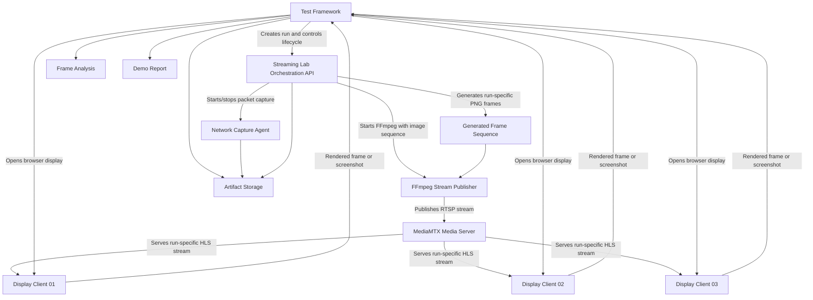
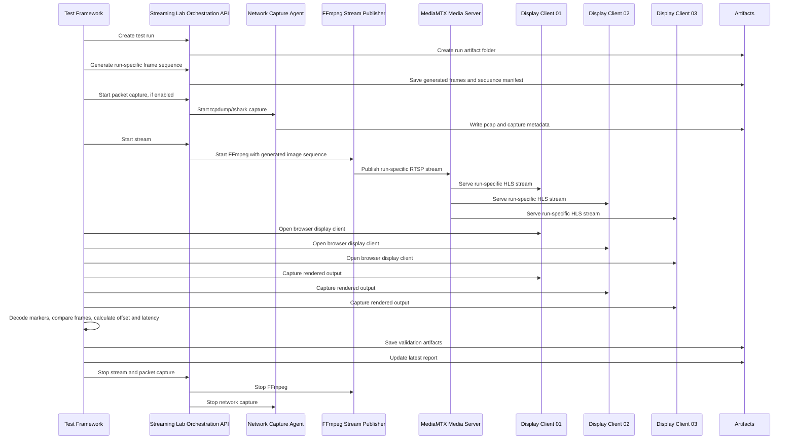
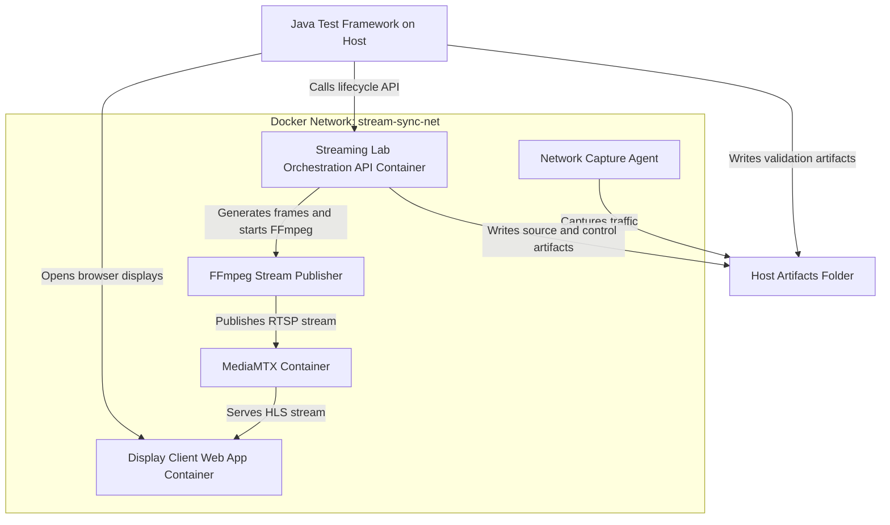
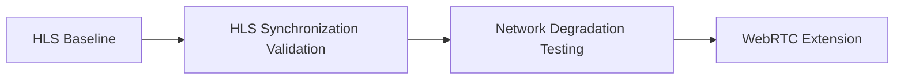

# Architecture

## Purpose

This document describes the architecture for the **Multi-Display Stream Synchronization Test Lab**.

The project is a proof-of-concept test automation lab for validating whether multiple network-connected display clients can receive, render, and remain synchronized on the same streaming video source.

The architecture is intentionally designed to be:

* local and reproducible;
* network-based rather than OS-only;
* focused on streaming video over IP/HTTP-style networks;
* test-framework friendly;
* test-result aware;
* extensible from HLS to WebRTC;
* extensible from Java to Node/TypeScript and Python;
* focused on measurable and evidence-based video-streaming behavior.

---

## What Are We Building?

We are building a test automation lab that simulates a simplified streaming-video distribution system.

The system generates a controlled synthetic video stream, publishes it through a media server, renders it in multiple browser-based display clients, and uses automated tests to validate synchronization behavior.

At a high level, the project answers this question:

> If the same video stream is delivered to multiple display clients over a network, can automation verify that all displays show the correct stream, continue rendering frames, and remain synchronized within an acceptable tolerance?

The first version focuses on:

* run-specific synthetic video generation;
* pre-generated QR-coded frame sequences;
* HLS streaming;
* Docker-based network simulation;
* browser-based virtual display clients;
* a Streaming Lab Orchestration API for controlled stream lifecycle management;
* Java-first test automation;
* deterministic source, frame, synchronization, latency, and frozen-display validation;
* optional packet capture for post-run network analysis;
* persistent artifact storage;
* human-readable demo reports;
* future support for Node/TypeScript, Python, WebRTC, and network impairment testing.

---

## Architecture Summary



The system is not intended to be a production streaming platform. It is a controlled environment for testing ideas related to streaming validation, display rendering, frame progression, synchronization, and post-run artifact review.

---

## Foundational Design Goals

| Goal                             | Description                                                                                                                                     |
| -------------------------------- | ----------------------------------------------------------------------------------------------------------------------------------------------- |
| Network-based validation         | The stream should be delivered over a network path, not only rendered from a local file.                                                        |
| Repeatability                    | Test inputs should be deterministic enough to support reliable automation.                                                                      |
| Run-specific stream content      | Each test run should produce a unique stream containing the active `testRunId` to avoid stale-content false positives.                          |
| First-frame and latency evidence | Latency mode should support frame 0/frame 1 validation by using pre-generated frame sequences and controlled stream start.                      |
| Browser-based display simulation | Virtual display clients should simulate multiple display endpoints without requiring physical displays.                                         |
| Measurable synchronization       | Synchronization should be evaluated using frame markers and defined tolerances.                                                                 |
| Network observability            | Packet captures should be available for post-run analysis when network capture is enabled.                                                     |
| Artifact-first failures          | Test failures should produce useful artifacts such as screenshots, logs, decoded markers, stack traces, offset measurements, and packet traces. |
| Report availability              | After a demo or test run, results should remain available through a stable local report path.                                                   |
| Framework portability            | Java, Node/TypeScript, and Python implementations should be able to validate the same scenario.                                                 |
| Protocol evolution               | HLS is used first, while WebRTC remains a planned extension.                                                                                    |
| Clear scope boundaries           | The project should distinguish virtual display validation from physical display validation.                                                     |

---

## What Components Exist?

The project is divided into infrastructure components, display components, and test automation components.

### Component Overview

| Component                         | Responsibility                                                                                                                                       |
| --------------------------------- | ---------------------------------------------------------------------------------------------------------------------------------------------------- |
| Streaming Lab Orchestration API   | Creates test runs, generates run-specific frame sequences, starts/stops FFmpeg, manages packet capture, and exposes stream/artifact metadata.        |
| Synthetic Frame Sequence Generator| Creates deterministic PNG frames with QR metadata, human-readable labels, frame numbers, timing fields, and active test run ID.                     |
| FFmpeg Stream Publisher           | Reads the generated image sequence and publishes it to MediaMTX.                                                                                    |
| Media Server                      | Receives the generated stream and exposes it to display clients over HLS first, with WebRTC planned later.                                          |
| Display Clients                   | Browser-based virtual displays that subscribe to the run-specific stream and render video.                                                          |
| Test Framework                    | Opens display clients, captures rendered output, decodes markers, performs deterministic assertions, and generates validation artifacts/reports.     |
| Frame Analysis                    | Extracts structured marker information from captured display output.                                                                                 |
| Network Capture Agent             | Captures network traffic, such as HLS playlist/segment requests and RTSP publish traffic, for post-run analysis.                                    |
| Artifact Collector                | Saves generated source frames, screenshots, frame snapshots, logs, offsets, latency data, packet captures, summaries, reports, and stack traces.     |
| Demo Report Generator             | Creates a human-readable report for the latest run.                                                                                                  |
| Network Layer                     | Provides a Docker-based simulated network environment.                                                                                               |
| Configuration                     | Defines source ID, display IDs, stream protocol, stream URL strategy, tolerance, duration, latency options, packet capture settings, and artifact path. |

---

## Component Responsibilities

### Streaming Lab Orchestration API

The **Streaming Lab Orchestration API** is a test-lab service provider.

It controls the lifecycle of a run-specific streaming environment. It is not the deterministic test oracle and it is not necessarily the real product API. Its role is to make the streaming lab controllable, repeatable, and observable.

The orchestration API is responsible for:

* creating a unique `testRunId`;
* generating run-specific synthetic frame sequences;
* writing a source sequence manifest;
* starting FFmpeg with the generated image sequence;
* publishing the stream to MediaMTX using a run-specific media path;
* exposing the run-specific HLS URL;
* starting and stopping packet capture when enabled;
* exposing stream status and artifact locations;
* stopping stream-related processes after the run.

The orchestration API should not:

* open browser clients for validation, unless used as a helper only;
* capture browser-rendered output;
* decode markers from browser screenshots;
* calculate synchronization offset;
* calculate observed render latency;
* decide pass or fail;
* replace the test framework.

The preferred boundary is:

```text
The Streaming Lab Orchestration API controls the environment.
The Java test framework validates the rendered result.
```

Suggested initial endpoints:

```text
POST /api/test-runs
POST /api/test-runs/{testRunId}/sequence/generate
POST /api/test-runs/{testRunId}/network-capture/start
POST /api/test-runs/{testRunId}/stream/start
GET  /api/test-runs/{testRunId}/stream/status
POST /api/test-runs/{testRunId}/stream/stop
POST /api/test-runs/{testRunId}/network-capture/stop
GET  /api/test-runs/{testRunId}/artifacts
```

The service may be implemented as a small local API running in Docker or on the host. It should be treated as part of the test lab infrastructure.

---

### Synthetic Stream Generator

The synthetic stream generator creates the controlled video input used by the tests.

The target implementation uses **pre-generated, run-specific PNG frame sequences**. FFmpeg then reads those frames as an image sequence and publishes them to MediaMTX.

This replaces the earlier idea of relying only on a live `testsrc + drawtext` FFmpeg command as the target strategy. `testsrc + drawtext` may still be useful for early smoke tests, but deterministic validation should use generated frames.

The generated video should include both machine-readable and human-readable information.

The machine-readable marker is the primary validation source. A QR code should encode structured metadata such as:

```json
{
  "source": "CAMERA_SYNC_TEST",
  "testRunId": "SYNC_RUN_20260605_001",
  "sequenceId": "SEQ_001",
  "frame": 0,
  "fps": 30,
  "presentationTimeMs": 0,
  "expectedPresentationEpochMs": 1780689600000
}
```

The field `expectedPresentationEpochMs` represents when the frame is expected to be presented relative to stream start. It does not represent the PNG file creation time.

The same information should also be shown as visible text below or near the marker:

```text
SOURCE: CAMERA_SYNC_TEST
TEST_RUN_ID: SYNC_RUN_20260605_001
SEQUENCE_ID: SEQ_001
FRAME: 000000
PRESENTATION: 0 ms
EXPECTED_PRESENTATION: 2026-06-05T14:00:00.000Z
```

The stream generator is responsible for:

* generating a repeatable, run-specific synthetic frame sequence;
* starting every deterministic sequence at frame 0;
* embedding source identity;
* embedding test run identity;
* embedding sequence identity;
* embedding frame progression information;
* embedding expected presentation timing information;
* rendering a QR code or equivalent machine-readable marker;
* rendering human-readable text for debugging;
* writing a sequence manifest;
* providing the generated frame sequence to FFmpeg for streaming.

---

### Run-Specific Frame Sequence Strategy

The target video generation strategy is:

```text
testRunId
  ↓
Generate PNG frames with QR metadata
  ↓
Write sequence-manifest.json
  ↓
FFmpeg image sequence input
  ↓
MediaMTX
  ↓
Run-specific HLS endpoint
```

For each test run, the orchestration API creates a unique `testRunId` and generates frames under the run artifact folder.

Example:

```text
artifacts/
  runs/
    SYNC_RUN_20260605_001/
      generated-frames/
        frame_000000.png
        frame_000001.png
        frame_000002.png
      source-sequence/
        sequence-manifest.json
```

The sequence manifest describes the generated source frames.

Example:

```json
{
  "testRunId": "SYNC_RUN_20260605_001",
  "source": "CAMERA_SYNC_TEST",
  "sequenceId": "SEQ_001",
  "fps": 30,
  "frameCount": 1800,
  "durationSeconds": 60,
  "resolution": "1280x720",
  "firstFrame": 0,
  "lastFrame": 1799,
  "framePattern": "generated-frames/frame_%06d.png",
  "mediaPath": "camera_sync_test_SYNC_RUN_20260605_001",
  "hlsUrl": "http://localhost:8888/camera_sync_test_SYNC_RUN_20260605_001/index.m3u8"
}
```

This design supports:

* deterministic frame numbers;
* frame 0/frame 1 validation for latency mode;
* run-specific content;
* stale stream detection;
* repeatable debugging;
* comparison between generated source frames and browser-captured frames.

FFmpeg should stream the generated image sequence.

Example:

```bash
ffmpeg -re \
  -framerate 30 \
  -i artifacts/runs/SYNC_RUN_20260605_001/generated-frames/frame_%06d.png \
  -c:v libx264 \
  -preset veryfast \
  -tune zerolatency \
  -pix_fmt yuv420p \
  -f rtsp \
  rtsp://mediamtx:8554/camera_sync_test_SYNC_RUN_20260605_001
```

MediaMTX then exposes the run-specific HLS endpoint:

```text
http://localhost:8888/camera_sync_test_SYNC_RUN_20260605_001/index.m3u8
```

---

## Marker Strategy for Synthetic Video Frames

The synthetic video stream should use a **machine-readable marker as the primary automation oracle** and human-readable text as supporting evidence.

The preferred frame design is:

```text
+--------------------------------------------------+
| QR CODE                                          |
| Payload:                                         |
| {                                                |
|   "source": "CAMERA_SYNC_TEST",                  |
|   "testRunId": "SYNC_RUN_20260605_001",          |
|   "sequenceId": "SEQ_001",                       |
|   "frame": 0,                                    |
|   "fps": 30,                                     |
|   "presentationTimeMs": 0,                       |
|   "expectedPresentationEpochMs": 1780689600000   |
| }                                                |
|                                                  |
| SOURCE: CAMERA_SYNC_TEST                         |
| FRAME: 000000                                    |
| TEST RUN: SYNC_RUN_20260605_001                  |
| SEQUENCE: SEQ_001                                |
| PRESENTATION: 0 ms                               |
+--------------------------------------------------+
```

The automation should rely primarily on the QR code or similar machine-readable marker because it is more reliable for automated frame validation than reading plain text through OCR.

Human-readable text should still be included because it makes screenshots and failure artifacts easier for developers and stakeholders to understand.

### Why Use a Machine-Readable Marker?

Plain frame numbers require OCR, which can be affected by:

* video compression;
* browser scaling;
* font rendering;
* anti-aliasing;
* screenshot quality;
* motion blur;
* resolution changes;
* contrast issues;
* timing differences between display clients.

A QR code or similar structured marker gives the test framework a more reliable way to extract the data needed for validation.

The marker should contain:

| Field                         | Purpose                                                                     |
| ----------------------------- | --------------------------------------------------------------------------- |
| `source`                      | Confirms the display is showing the expected stream.                        |
| `testRunId`                   | Prevents false positives from stale or previous test content.               |
| `sequenceId`                  | Identifies the generated source sequence for the run.                       |
| `frame`                       | Allows frame progression, synchronization, and first-frame checks.          |
| `fps`                         | Supports frame-to-time conversion.                                          |
| `presentationTimeMs`          | Identifies the frame's intended time within the source sequence.            |
| `expectedPresentationEpochMs` | Supports observed render latency calculation relative to stream start time. |

### Marker Usage in Synchronization Testing

For synchronization validation, the test framework should decode the marker from each display and compare the frame numbers.

Example:

```text
DISPLAY_01 frame = 1050
DISPLAY_02 frame = 1049
DISPLAY_03 frame = 1051
```

The test calculates:

```text
max frame offset = max(frame) - min(frame)
max frame offset = 1051 - 1049 = 2 frames
```

If the configured tolerance is 3 frames, this sample passes.

```text
Expected tolerance: <= 3 frames
Actual offset: 2 frames
Result: PASS
```

### Marker Strategy Decision

The initial marker strategy is:

| Element                          | Role                                         |
| -------------------------------- | -------------------------------------------- |
| QR code                          | Primary automation oracle                    |
| Human-readable source label      | Manual debugging and artifact review         |
| Human-readable frame number      | Manual debugging and screenshot review       |
| Human-readable timestamp         | Manual debugging and latency investigation   |
| Background color or visual theme | Quick visual differentiation between sources |

### Future Marker Options

The first implementation should prioritize QR code payloads because they can encode the full test metadata directly.

Future options may include:

* ArUco markers for faster computer-vision detection;
* multiple markers per frame for stronger detection;
* fixed marker placement to simplify frame analysis;
* source-specific background colors;
* marker confidence scoring;
* fallback OCR only for debugging, not primary assertions.

---

### Media Server

The media server receives the video stream and exposes it to display clients.

The initial implementation will use **MediaMTX**.

The media server is responsible for:

* accepting the stream from FFmpeg;
* exposing the stream through HLS;
* allowing multiple display clients to subscribe to the same source;
* providing a networked stream path instead of local file playback.

Example HLS endpoint:

```text
http://localhost:8888/camera_sync_test_SYNC_RUN_20260605_001/index.m3u8
```

---

### Display Clients

Display clients are browser-based virtual displays.

Each display client represents one screen or display endpoint.

Example display clients:

```text
DISPLAY_01
DISPLAY_02
DISPLAY_03
```

Each display client is responsible for:

* loading the configured HLS stream;
* rendering the video in a browser;
* exposing a stable visual surface for screenshot or frame capture;
* representing a network-connected display endpoint.

The first version may use a simple HTML page with `hls.js`.

Example conceptual URL:

```text
http://localhost:3000/display.html?displayId=DISPLAY_01&source=camera_sync_test&testRunId=SYNC_RUN_20260605_001
```

---

### Test Framework

The test framework controls the validation process.

The first implementation will use **Java**.

The test framework is responsible for:

* loading shared configuration;
* creating or receiving a test run ID;
* calling the Streaming Lab Orchestration API to generate the sequence and start the stream;
* opening multiple display clients;
* waiting for stream playback;
* capturing screenshots or rendered frames;
* decoding markers from rendered output;
* validating source consistency;
* validating frame progression;
* calculating synchronization offset;
* detecting frozen displays;
* calculating observed render latency when latency mode is enabled;
* verifying packet-capture artifacts when capture is enabled;
* saving validation artifacts;
* writing stack traces when failures occur;
* producing pass/fail results;
* making the latest demo report available after execution.

---

### Frame Analysis

Frame analysis determines what each display is showing.

The preferred approach is to decode a machine-readable marker from each captured display frame.

The first target implementation should use a QR code or similar marker that contains:

```json
{
  "source": "CAMERA_SYNC_TEST",
  "testRunId": "SYNC_RUN_20260605_001",
  "sequenceId": "SEQ_001",
  "frame": 184,
  "fps": 30,
  "presentationTimeMs": 6133.333,
  "expectedPresentationEpochMs": 1780689606133
}
```

The automation should use the decoded marker to validate:

* the display is showing the expected source;
* the frame belongs to the current test run;
* the frame belongs to the expected generated sequence;
* the frame number is progressing over time;
* the frame number is close enough to the other displays;
* the first observed frame satisfies latency-mode policy when required;
* the expected presentation timestamp supports observed render latency calculation.

Human-readable text may still be rendered in the video frame, but it should be treated as supporting evidence rather than the primary automation oracle.

Possible frame analysis approaches:

| Approach              | Usage                                                                  |
| --------------------- | ---------------------------------------------------------------------- |
| QR code decoding      | Preferred first implementation for structured metadata extraction      |
| ArUco marker decoding | Future option for robust computer-vision marker detection              |
| Visible text/OCR      | Useful for manual debugging, but not preferred for primary assertions  |
| Screenshot comparison | Useful for simple visual checks, but can be brittle                    |
| OpenCV frame analysis | Useful for advanced marker detection and future capture-card workflows |

The long-term goal is to make frame validation deterministic, structured, and repeatable across Java, Node/TypeScript, and Python implementations.

---

### Artifact Collector and Demo Report

The artifact collector stores test outputs in a persistent format.

The project should produce two levels of output:

1. **Raw run artifacts** for debugging and historical review.
2. **Latest demo report** for quick local review after execution.

Raw run artifacts should be stored by test run:

```text
artifacts/
  runs/
    SYNC_RUN_20260605_001/
      summary.json
      offsets.csv
      latency.csv
      failure-summary.md
      failure-stacktrace.txt
      generated-frames/
        frame_000000.png
        frame_000001.png
        frame_000002.png
      source-sequence/
        sequence-manifest.json
      screenshots/
        display_01_frame.jpg
        display_02_frame.jpg
        display_03_frame.jpg
      logs/
        test-runner.log
        ffmpeg.log
        mediamtx.log
        control-api.log
      raw/
        marker-samples.jsonl
      network/
        full-run.pcap
        tshark-summary.txt
        capture-metadata.json
```

The latest report should be copied or generated into a stable location:

```text
artifacts/
  latest/
    index.html
    summary.json
    offsets.csv
    latency.csv
    failure-summary.md
    failure-stacktrace.txt
    screenshots/
      display_01_frame.jpg
      display_02_frame.jpg
      display_03_frame.jpg
    logs/
      test-runner.log
      ffmpeg.log
      mediamtx.log
      control-api.log
    raw/
      marker-samples.jsonl
    network/
      full-run.pcap
      tshark-summary.txt
      capture-metadata.json
```

The `artifacts/latest/index.html` file should be the main report opened after a demo run.

It should show:

* test run ID;
* source ID;
* stream protocol;
* network mode;
* participating displays;
* pass/fail result;
* max frame offset;
* average frame offset;
* tolerance;
* frozen display status;
* first observed frame per display when latency mode is enabled;
* observed render latency when latency mode is enabled;
* packet-capture links when network capture is enabled;
* screenshots from each display;
* links to raw artifact files;
* failure summary when applicable;
* failure stack trace when applicable.

The artifact collector is responsible for:

* creating a test-run-specific folder;
* creating or updating `artifacts/latest/`;
* saving screenshots or frame snapshots;
* saving decoded marker data;
* saving synchronization measurements;
* saving logs when available;
* saving a machine-readable `summary.json`;
* saving a human-readable `failure-summary.md`;
* saving a stack trace file when a test failure occurs;
* generating or updating a human-readable `index.html` report.

---

### Network Layer

The project uses Docker networking to simulate an internet-style streaming environment.

The goal is to avoid testing only local OS playback. Components should communicate over a network, even when everything runs on one development machine.

The network layer is responsible for:

* isolating project services on a shared Docker network;
* enabling service-to-service communication;
* supporting packet capture for post-run analysis;
* supporting future network impairment tests;
* providing a repeatable local network topology.

Network capture may include:

* HLS playlist requests;
* HLS media segment requests;
* RTSP publish traffic from FFmpeg to MediaMTX;
* TCP retransmissions;
* connection resets;
* timing differences between display clients.

Future network simulations may include:

* latency;
* jitter;
* packet loss;
* bandwidth limitation;
* client disconnects;
* media server restart;
* display client restart.

---

## How Do Components Communicate?

The main communication path is:



### Communication Summary

| From                            | To                         | Communication                                                                 |
| ------------------------------- | -------------------------- | ----------------------------------------------------------------------------- |
| Test framework                  | Streaming Lab Orchestration API | Creates test run and controls lifecycle.                                  |
| Streaming Lab Orchestration API | Artifact folder            | Writes generated frames, sequence manifest, logs, and capture metadata.       |
| Streaming Lab Orchestration API | FFmpeg                     | Starts/stops FFmpeg using the generated frame sequence.                       |
| FFmpeg                          | MediaMTX                   | Publishes run-specific synthetic video stream.                                |
| MediaMTX                        | Display clients            | Serves run-specific HLS stream over HTTP.                                     |
| Test framework                  | Display clients            | Opens pages and captures rendered output.                                     |
| Test framework                  | Artifacts folder           | Writes screenshots, JSON, CSV, logs, stack traces, latency data, and reports. |
| Network Capture Agent           | Artifacts folder           | Writes `.pcap` files and capture summaries.                                   |
| Display clients                 | MediaMTX                   | Subscribe to the HLS stream.                                                  |
| Future orchestration API        | Network controller         | May apply latency, packet loss, jitter, bandwidth limits, or disconnects.     |

---

## What Runs in Docker?

The project uses Docker to create a repeatable networked environment.

The expected Docker-managed components are:

| Component                       | Runs in Docker? | Notes                                                                                  |
| ------------------------------- | --------------: | -------------------------------------------------------------------------------------- |
| MediaMTX                        |             Yes | Runs as the media server.                                                              |
| Streaming Lab Orchestration API |    Yes, planned | Controls test-run lifecycle, frame generation, FFmpeg process, and packet capture.     |
| Frame generator                 |    Yes, planned | May run inside the orchestration API container or as a helper process/container.       |
| FFmpeg stream publisher         |    Yes, planned | Reads generated frames and publishes the run-specific stream to MediaMTX.              |
| Display client app              |    Yes, planned | Serves the browser-based display page.                                                 |
| Network capture agent           |    Yes, planned | Captures `.pcap` files using tcpdump/tshark when enabled.                              |
| Network simulation tools        |    Yes, planned | Toxiproxy, Linux `tc/netem`, or similar tools may run in Docker later.                 |
| Java test framework             |        Optional | Can run locally first, and later in Docker or CI.                                      |
| Node test framework             |        Optional | Future implementation.                                                                 |
| Python test framework           |        Optional | Future implementation.                                                                 |

### Initial Docker Topology



The first implementation can run the Java test framework on the host machine to simplify browser automation and local development.

Later, the test framework can also run inside Docker or through CI.

If the test framework runs inside Docker, the host `./artifacts` folder should be mounted into the test-runner container:

```yaml
volumes:
  - ./artifacts:/app/artifacts
```

This ensures artifacts remain available after containers stop.

---

## What Runs in the Test Framework?

The test framework should not own the entire streaming system. It should orchestrate and validate it.

The test framework is responsible for:

* reading test configuration;
* creating or receiving a test run ID;
* calling the Streaming Lab Orchestration API to generate frames and start the stream;
* checking required services are available;
* opening display clients;
* waiting for playback readiness;
* capturing rendered output;
* decoding visible or machine-readable markers;
* calculating frame offset;
* calculating observed render latency when enabled;
* detecting frozen displays;
* verifying packet-capture artifacts when network capture is enabled;
* applying pass/fail rules;
* writing validation artifacts to `artifacts/runs/{testRunId}/`;
* writing the latest report to `artifacts/latest/`;
* preserving failure stack traces when tests fail.

The test framework should avoid:

* embedding large media-server configuration directly in test cases;
* directly managing FFmpeg lifecycle when the orchestration API owns it;
* hardcoding stream URLs in multiple places;
* mixing protocol logic with assertions;
* depending on manual observation;
* making pass/fail decisions through Gen AI;
* relying only on console output for demo results.

---

## Test-Aware Architecture

The architecture is designed to make test results inspectable after each demo run.

The test framework should not only return pass or fail. It should produce structured artifacts that explain what happened during the streaming scenario.

Each demo run should generate:

* a test execution result;
* generated source frames for the run;
* a source sequence manifest;
* screenshots or captured frames from each display;
* decoded marker data;
* frame offset measurements;
* latency measurements when latency mode is enabled;
* packet captures when network capture is enabled;
* logs from the test runner, orchestration API, and streaming components;
* a machine-readable `summary.json`;
* a human-readable `index.html` report;
* a human-readable `failure-summary.md` when applicable;
* a `failure-stacktrace.txt` file when applicable.

The goal is that a reviewer can run the demo, open the generated report, and understand:

* which stream was expected;
* which protocol was used;
* which displays participated;
* whether each display rendered the expected stream;
* whether frames progressed;
* whether synchronization stayed within tolerance;
* why the test failed, if applicable;
* where to inspect raw artifacts.

---

## Artifact Storage and Report Availability

The project must persist test artifacts after execution.

Demo runs should not rely only on console output because console logs are not enough to explain streaming behavior after the run finishes.

Each test run should write artifacts to a persistent host-accessible directory.

Recommended local structure:

```text
artifacts/
  runs/
    {testRunId}/
      summary.json
      offsets.csv
      latency.csv
      failure-summary.md
      failure-stacktrace.txt
      generated-frames/
      source-sequence/
        sequence-manifest.json
      screenshots/
      logs/
      raw/
        marker-samples.jsonl
      network/
        full-run.pcap
        tshark-summary.txt
        capture-metadata.json

  latest/
    index.html
    summary.json
    offsets.csv
    latency.csv
    failure-summary.md
    failure-stacktrace.txt
    screenshots/
    logs/
    raw/
    network/
```

The `runs/{testRunId}` folder preserves historical results.

The `latest` folder provides a stable location for the most recent report.

The demo command should print the report location at the end of execution:

```text
Demo test completed.

Result:
  PASS

Report:
  artifacts/latest/index.html

Raw artifacts:
  artifacts/runs/{testRunId}/
```

For failures, the demo command should also print the failure reason and stack trace location:

```text
Demo test completed.

Result:
  FAIL

Reason:
  Synchronization offset exceeded tolerance.

Report:
  artifacts/latest/index.html

Stack trace:
  artifacts/latest/failure-stacktrace.txt

Raw artifacts:
  artifacts/runs/{testRunId}/
```

In GitHub Actions, the `artifacts/` folder should be uploaded using `actions/upload-artifact` with `if: always()` so results are available even when tests fail.

A later GitHub Pages workflow may publish `artifacts/latest/` as a static public report for portfolio/demo review.

---

## What Is Java Responsible For?

Java is the first implementation language for the test automation framework.

Java is responsible for the initial enterprise-style automation layer.

Java should handle:

* JUnit 5 test execution;
* shared configuration loading;
* calling the Streaming Lab Orchestration API;
* browser automation through Playwright for Java;
* screenshot or frame capture from display clients;
* marker extraction or integration with marker-decoding utilities;
* synchronization analysis;
* frozen display detection;
* observed render latency calculation;
* verification of packet-capture artifacts when enabled;
* validation artifact writing;
* failure stack trace preservation;
* structured test reporting;
* latest demo report generation.

### Java Package Direction

A future Java implementation may use a structure similar to:

```text
test-frameworks/java/
  src/main/java/com/streamsync/
    config/
    display/
    artifacts/
    marker/
    control/
    capture/
    media/
    network/
    stream/
    sync/
    latency/
    report/
    util/

  src/test/java/com/streamsync/
    FrameworkSmokeTest.java
    MultiDisplaySyncTest.java
```

### Java Abstractions

| Class or Interface        | Responsibility                                                                             |
| ------------------------- | ------------------------------------------------------------------------------------------ |
| `ConfigLoader`            | Loads shared YAML configuration.                                                           |
| `TestRunContext`          | Holds test run ID, source ID, sequence ID, stream URL, display IDs, and artifact paths.     |
| `OrchestrationClient`     | Calls the Streaming Lab Orchestration API.                                                  |
| `DisplayClient`           | Represents one virtual display endpoint.                                                    |
| `FrameCapture`            | Captures a screenshot or rendered frame.                                                    |
| `MarkerDecoder`           | Extracts source ID, test run ID, sequence ID, frame number, FPS, and timing fields.          |
| `SyncAnalyzer`            | Calculates frame offset and drift.                                                          |
| `FrozenDisplayDetector`   | Detects stale or frozen display behavior.                                                   |
| `LatencyAnalyzer`         | Calculates observed render latency.                                                         |
| `FirstFramePolicy`        | Validates frame 0/frame 1 requirements for latency mode.                                    |
| `NetworkCaptureVerifier`  | Verifies expected packet-capture artifacts when capture is enabled.                         |
| `ArtifactCollector`       | Writes screenshots, JSON, CSV, logs, stack traces, marker samples, and validation artifacts. |
| `ReportGenerator`         | Generates `artifacts/latest/index.html`.                                                    |
| `MediaServerClient`       | Checks stream/media server availability when needed.                                        |
| `ProtocolAdapter`         | Supports HLS first and WebRTC later.                                                        |

---

## Where Will Node/TypeScript Fit Later?

Node/TypeScript is planned as a future test framework implementation.

It is especially useful for browser-heavy automation because Playwright is very mature in the Node ecosystem.

Node/TypeScript may be used for:

* Playwright-first browser display testing;
* fast browser workflow experimentation;
* display-client interaction;
* screenshot capture;
* HLS playback validation;
* future WebRTC browser validation;
* comparison with the Java framework.

A future Node structure may look like:

```text
test-frameworks/node/
  package.json
  playwright.config.ts
  src/
    clients/
    capture/
    config/
    artifacts/
    marker/
    sync/
    report/
    utils/
  tests/
    multi-display-sync.spec.ts
```

Node should consume the same shared configuration and produce the same artifact format as Java.

---

## Where Will Python Fit Later?

Python is planned as a future test framework or analysis implementation.

It is especially useful for image processing, computer vision, and video-frame analysis.

Python may be used for:

* OpenCV-based frame analysis;
* QR or marker decoding;
* offset calculations;
* artifact post-processing;
* CSV/JSON reporting;
* future capture-card integration;
* frame-by-frame video analysis.

A future Python structure may look like:

```text
test-frameworks/python/
  pyproject.toml
  pytest.ini
  src/
    streamsync/
      clients/
      capture/
      config/
      artifacts/
      marker/
      sync/
      report/
      utils/
  tests/
    test_multi_display_sync.py
```

Python should consume the same shared configuration and produce the same artifact format as Java and Node/TypeScript.

---

## Why HLS First?

HLS is selected for the first implementation because it is practical for a browser-based proof of concept.

Reasons to start with HLS:

* It is browser-friendly when used with `hls.js`.
* It is easier to debug than WebRTC.
* It works well with HTTP-based local streaming.
* It fits naturally with MediaMTX.
* It reduces early project complexity.
* It allows the project to validate the core test strategy before adding real-time protocol complexity.

HLS is not the lowest-latency streaming option, but the first milestone is not to prove low-latency production streaming. The first milestone is to prove that automation can validate:

* stream availability;
* source consistency;
* frame progression;
* multi-display frame offset;
* frozen display detection;
* observed render latency as a full path metric;
* artifact collection;
* packet capture when enabled;
* report generation.

---

## Why WebRTC Later?

WebRTC is planned as a later extension because it is more realistic for lower-latency streaming, but it introduces additional complexity.

WebRTC may be added later to validate:

* lower-latency playback;
* real-time display synchronization;
* connection state handling;
* reconnect behavior;
* browser peer-connection behavior;
* differences between HLS and WebRTC synchronization behavior.

Reasons to defer WebRTC:

* signaling and session setup add complexity;
* browser behavior can be harder to debug;
* autoplay and connection-state issues may affect test stability;
* network negotiation introduces more failure modes;
* the project first needs a working baseline.

The planned protocol path is:



---

## What Is Inside the Project Scope?

The project scope includes:

* generating run-specific synthetic frame sequences;
* streaming generated frames through FFmpeg and a local media server;
* delivering video over a Docker network;
* playing HLS streams in browser-based display clients;
* validating multiple virtual displays;
* measuring source consistency;
* measuring frame progression;
* measuring frame offset across displays;
* detecting frozen displays;
* measuring observed render latency when latency mode is enabled;
* capturing network traffic when packet capture is enabled;
* collecting persistent artifacts;
* generating a latest demo report;
* preserving stack traces for failed tests;
* creating Java-first automation;
* supporting future Node/TypeScript and Python implementations;
* preparing for future WebRTC support;
* preparing for future network degradation testing;
* preparing for GitHub Actions artifact upload.

---

## What Is Outside the Project Scope?

The project does not currently include:

* validating a physical video wall;
* validating HDMI output;
* validating capture-card input;
* validating GPU-specific rendering performance;
* validating commercial AV-over-IP hardware;
* validating a production-grade streaming platform;
* validating actual public internet behavior across regions;
* building a full media server;
* building a full display-management product;
* treating the Streaming Lab Orchestration API as a production product API;
* using Gen AI for pass/fail decisions.

These may be considered future extensions, but they are not part of the initial scope.

---

## Scope Boundary: Virtual Display vs Physical Display

The initial architecture validates browser-based virtual displays.

This means the project can prove:

* the browser client loaded the stream;
* the expected source was rendered;
* frames progressed;
* frame offsets could be measured;
* display clients behaved consistently under the test conditions.

It does not prove:

* the content appeared on a physical monitor;
* HDMI output was correct;
* a hardware video wall was synchronized;
* external display devices behaved correctly.

Physical output validation would require a different architecture, likely involving:

* capture cards;
* real display clients;
* HDMI outputs;
* external cameras;
* lab hardware;
* capture-agent services.

---

## Scope Boundary: Deterministic Automation vs Gen AI

The core validation should remain deterministic.

The test framework should calculate pass/fail results using structured data:

* expected source;
* decoded source;
* test run ID;
* sequence ID;
* frame number;
* frame progression;
* frame offset;
* tolerance;
* timeout;
* first-frame policy;
* expected presentation timestamp;
* browser capture timestamp;
* network mode;
* protocol;
* packet-capture status.

Gen AI may be added later as an optional post-test analysis layer.

Gen AI can help with:

* failure summarization;
* likely failure classification;
* stakeholder-friendly reports;
* suggested debugging steps.

Gen AI should not decide whether the test passed or failed.

---

## Shared Configuration Model

All test framework implementations should use the same configuration model.

Example:

```yaml
testRun:
  sourceId: CAMERA_SYNC_TEST
  displays:
    - DISPLAY_01
    - DISPLAY_02
    - DISPLAY_03
  durationSeconds: 60
  sampleIntervalMs: 500
  toleranceFrames: 3

stream:
  protocol: HLS
  hlsUrl: http://localhost:8888/camera_sync_test_SYNC_RUN_20260605_001/index.m3u8
  futureProtocols:
    - WebRTC
  fps: 30

network:
  mode: docker
  dockerNetwork: stream-sync-net
  impairmentEnabled: false

artifacts:
  outputDir: artifacts
  latestDir: artifacts/latest
```

This keeps Java, Node/TypeScript, and Python aligned.

---

## Expected Repository Layout

```text
multi-display-stream-sync/
  README.md
  docker-compose.yml
  .gitignore

  docs/
    architecture.md
    streaming-plan.md
    video-stream-test-strategy.md
    test-framework-strategy.md
    streaming-lab-orchestration-api.md
    evidence-format.md

  config/
    test-config.yaml
    mediamtx.yml

  stream-orchestrator/
    Dockerfile
    src/
    README.md

  frame-generator/
    scripts/
      generate-frames.ps1
      generate-frames.sh

  stream-publisher/
    Dockerfile
    scripts/
      publish-frame-sequence.ps1
      publish-frame-sequence.sh

  media-server/
    mediamtx.yml

  display-client/
    Dockerfile
    package.json
    src/
      index.html
      app.js
      styles.css

  network-capture/
    Dockerfile
    scripts/
      start-capture.sh
      stop-capture.sh

  artifacts/
    .gitkeep

  test-frameworks/
    java/
      pom.xml
      src/
        main/java/
        test/java/

    node/
      package.json
      playwright.config.ts
      src/
      tests/

    python/
      pyproject.toml
      pytest.ini
      src/
      tests/
```

---

## Architecture Principles

### 1. Keep streaming infrastructure separate from test logic

The media server, stream publisher, frame generator, orchestration API, and display clients should be configurable infrastructure, not hidden inside test methods.

### 2. Keep orchestration separate from validation

The Streaming Lab Orchestration API should control the environment. The test framework should validate browser-rendered behavior and decide pass/fail.

### 3. Use run-specific generated content

Each test run should generate a unique frame sequence containing the active `testRunId`. This prevents stale stream false positives and supports deterministic latency validation.

### 4. Keep tests readable

A test should describe the scenario clearly:

```text
Given the stream is available
When three display clients render it
Then the frame offset should remain within tolerance
```

### 5. Keep artifacts consistent

All frameworks should write comparable artifacts.

### 6. Keep protocols replaceable

HLS should be the first protocol, but the architecture should allow WebRTC later.

### 7. Keep pass/fail deterministic

The automation should use measurable data for assertions.

### 8. Keep scope honest

The initial project validates virtual display clients, not physical display walls.

### 9. Keep the marker machine-readable

The QR code or equivalent marker should be the primary source of truth for automated validation. Human-readable text should support debugging and artifact review.

### 10. Keep reports available after execution

A demo run should leave behind persistent artifacts and a stable latest report. The result should not disappear when containers stop or terminal output is cleared.

---

## Summary

This architecture creates a controlled, network-based lab for validating multi-display video stream synchronization.

The first version will use:

* the Streaming Lab Orchestration API for controlled run lifecycle management;
* pre-generated, run-specific PNG frame sequences;
* FFmpeg for publishing generated frame sequences;
* QR-code-based frame markers as the primary validation oracle;
* MediaMTX as the media server;
* HLS as the first streaming protocol;
* browser-based virtual display clients;
* Docker networking for local network simulation;
* optional packet capture for post-run network analysis;
* Java as the first test automation framework;
* deterministic source, frame progression, synchronization, frozen display, and latency validation;
* persistent artifact storage under `artifacts/`;
* a stable latest demo report under `artifacts/latest/`;
* shared artifact and configuration formats.

Future versions may add:

* Node/TypeScript test automation;
* Python frame analysis;
* WebRTC streaming;
* network impairment;
* richer packet-capture analysis;
* capture-card validation;
* physical display validation;
* GitHub Actions artifact publishing;
* GitHub Pages report publishing;
* Gen AI-assisted failure analysis.

The architecture is intentionally scoped to demonstrate practical, measurable, and evidence-based validation of streaming video behavior across multiple display clients.
